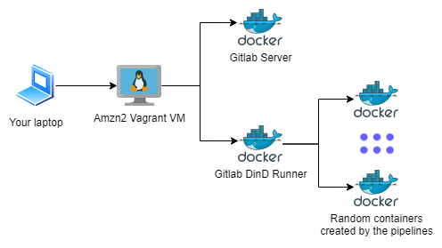
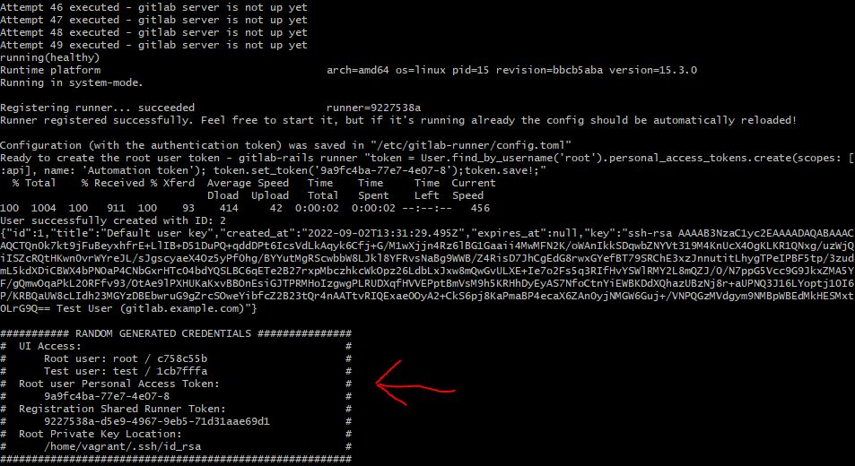
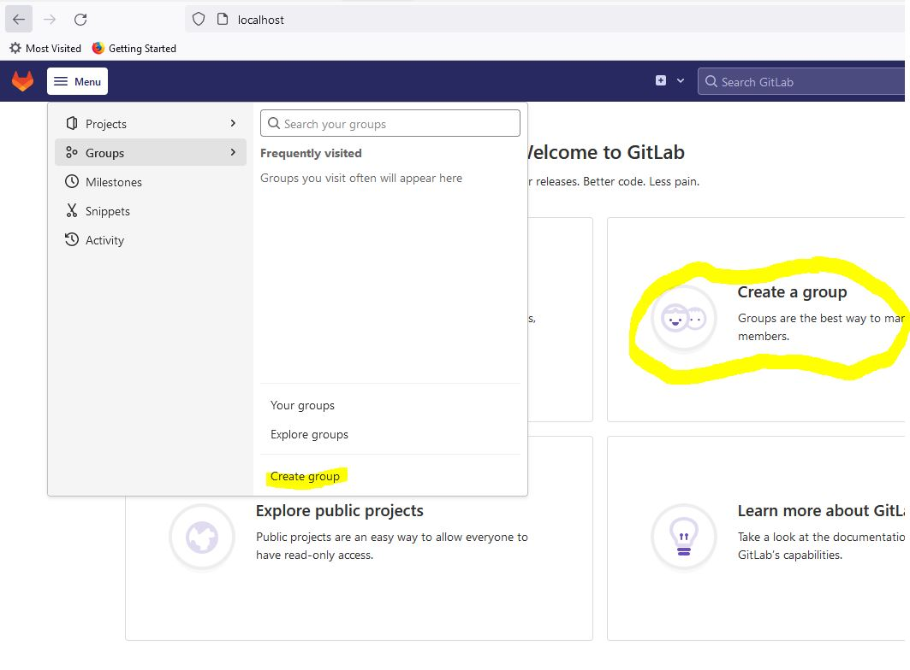
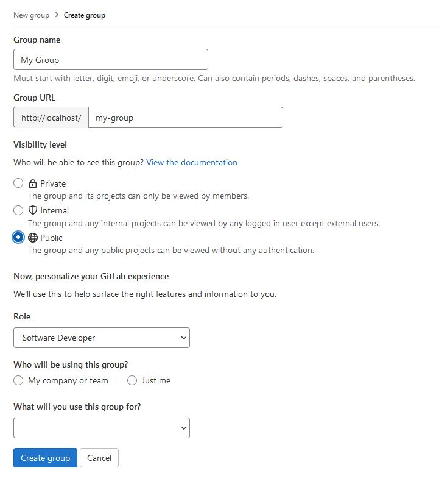
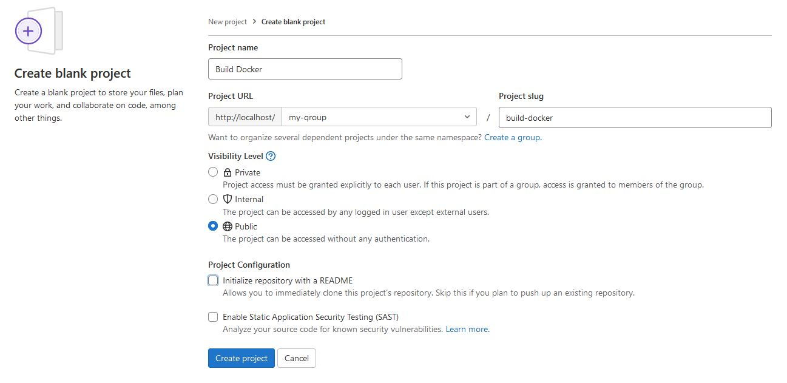
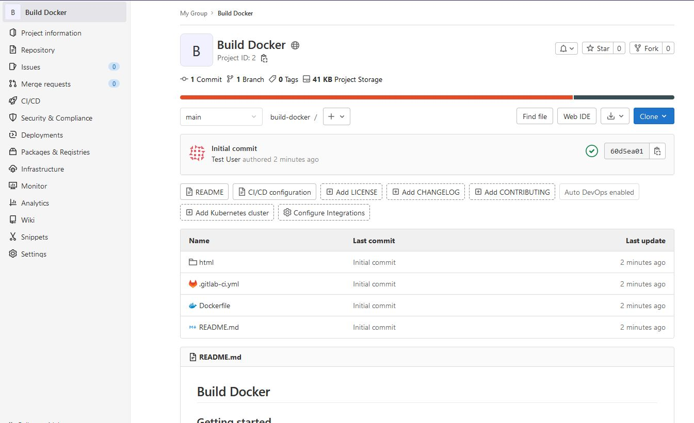
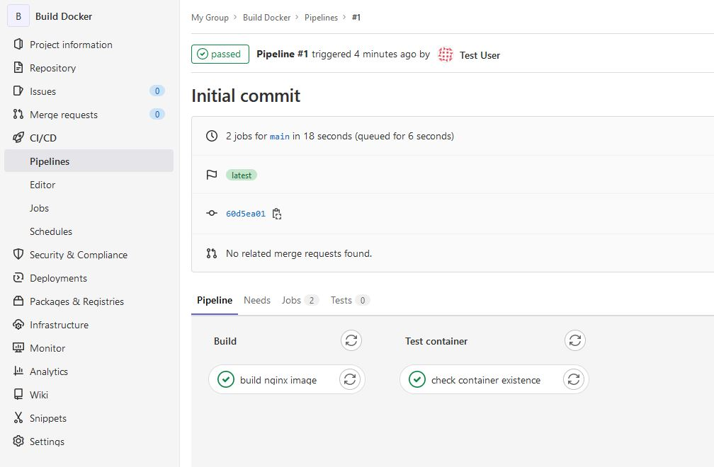

# Local Gitlab server + runner

This is a sample project intended to create a Gitlab
Community Edition server and one shared runner with
DinD (Docker in Docker) capabilities using 
docker-compose.

This write-up was motivated by the lack of 
documentation in the wild on how to create or
troubleshoot problems with this kind of set up.

*IMPORTANT DISCLAIMER*: Never, ever, use this POC
in production or any public environment. Although it 
does not contain hard coded credentials, the solution
is not hardened for any serious environment. This is 
only a POC for a better understanding of the Gitlab 
capabilities and automation processes using Docker. 
Only run this POC in your own computer.

## High level view

This project uses several levels of virtualization
and containerization displayed on the diagram below.



I strongly recommend the use of Vagrant for several
reason, but the two most important are:

1. It creates a common ground to prevent weird OS
   mismatches that are extremely hard to troubleshoot;
2. All scripts in this POC are written for Linux.

## Requirements

* Vagrant
* VirtualBox
* Understanding of basic virtualization (shared  
  folders, port forwarding, provisioning)
* Understanding of Docker and containerization

## Key elements

There are three key elements in this POC and each
one of them will be discussed in details below.

### Vagrantfile

The Vagrantfile is responsible for the first level
of virtualization in this project, abstracting the
complexities of creating a VM in VirtualBox. 

It not only creates an Amazon Linux 2 virtual 
machine as it runs a series of commands (called
provisioning) that install Docker, Docker Compose,
GIT and JQ. It also enables and starts the Docker
daemon.

It also forwards ports from the VM to the host system,
namely the ports used to expose the GitLab service: `80`,
for HTTP and `8822` for SSH.

### Docker Compose

The second front is the containerization of the
application, which is provided by `docker-compose.yml`.

This is the most important element of this POC and
the one that must be especially discussed.

It is composed (no pun intended) of three main
elements, the network where the containers will run,
the Gitlab server container, and the Runner container.

#### Docker network

One important aspect of this resource is that we must
set up explicitly the subnet prefix, as our Runner 
depends on the Gitlab server IP to set up its 
_extra_hosts_. If the CIDR is not explicitly set
Docker can create any prefix and then the workaround
to configure the proper data will be an overkill.

#### Gitlab server container

The GitLab server container creates volumes to persist
the data in your Vagrant VM, configures the necessary
environment variables for the Gitlab server startup, 
including the important OMNIBUS config, and finally
exposes the ports to provide web access to the server.
Although there are more ports exposed, the main ones
are `80` and `8822`.

The port `80` is used to access the Web UI through your
browser (in the host OS) using http://localhost/users/sign_in

The port `8822` is used to connect through SSH to the git 
repositories you can create in your GitLab server, for
example:

```shell
git remote add origin ssh://git@localhost:8822/my_org/build-docker.git
```

#### Gitlab runner container

The Gitlab runner is created based on the runner official 
Alpine image where docker and docker compose are 
installed (ref: [runner Dockerfile](./runner/Dockerfile)).

Moreover, several environment variables are also 
created. All these environment variables are used to
control the registration process between the runner
and the server, inside the docker network created.

Special attention must be taken to the following 
environment variables:

* `DOCKER_EXTRA_HOSTS`, allows the runner to identify the
  Gitlab server in the docker network, as apparently the 
  runner does not use the same network configuration as
  the container;
* `DOCKER_NETWORK_MODE`, without this explicit 
  declaration the jobs on a pipeline cannot identify
  the Gitlab server and cannot resolve its DNS;
* `DOCKER_VOLUMES`, adding the docker socket file
   allows the use of Docker inside this docker container;
* `DOCKER_PRIVILEGED`, if you plan to run containers in
  DinD, this is a necessary evil, with all the underlying
  security implications, but it is not possible to run
  DinD without a container with special privileges on
  the underlying OS (ref: https://brauner.github.io/2019/02/12/privileged-containers.html).

#### Volumes

One more important distinction must be made regarding
the volumes used by the containers. If you check the
[docker-compose.yml](docker-compose.yml) file you can
see that all volumes are mapped to `/tmp` in the VM.

It is necessary to overcome an annoying problem with
VirtualBox and Windows not being able to create 
symbolic links, so instead of trying to work around an
ancient problem, I just decided to use the "native" OS
filesystem (Linux) and avoid any problems at all.

Also notice that the `docker.sock` pseudo-file is 
mounted on the runner container, and it will also
be mounted in the containers created/used by any 
pipeline in chain. This is done because the only
real daemon running is the one on the Vagrant VM,
and the chained containers just use the underlying
kernel to execute their tasks.

### Shell scripts (bootstrap.sh and destroy.sh)

These are wrapper scripts around the docker compose
file and the API/CLI used by Gitlab.

#### bootstrap.sh

[bootstrap.sh](./bootstrap.sh) wraps the spin up
process and the registering of the runner with the
Gitlab server, the creation of a `root` account token,
the creation of a `test` user, and finally the setup
of a randomly generated private key for the `test` user.

#### destroy.sh

[destroy.sh](./destroy.sh) executes the steps to 
completely remove the docker containers and network
created, along with the complete removal of the
volumes in the VM and the random key generated.

## Usage

Now the theory is laid down, let's check the practical use
of this POC. It all starts with the creation of the
Vagrant VM and accessing it.

```shell
vagrant up
vagrant ssh
```

The initial start up of the VM may take a while, as
all the provisioning will run.

After the VM is up and you are able to SSH into it,
run the `provision.sh` file. That will trigger the
containers creation and the CLI and API interactions
with the Gitlab server container.

```shell
sh provision.sh
```

You will notice Gitlab takes a long while to come up,
in average 5 minutes. The process will continuously
try for ten minutes to check if the server container
is `healthy`. If it does not come up in ~10 minutes
the process will automatically abort, and you must run
`sh destroy.sh`.

```shell
sh destroy.sh
```

Assuming your environment starts correctly, you don't 
need to ever run `destroy.sh` if you plan to keep
using Gitlab for local tests. Destroy is a clean-up 
process intended to free up space in the VM and 
completely wipe all data.

### Using GIT to interface with Gitlab

The Vagrant VM contains the GIT client. And this 
repository contains an example of a build pipeline
to generate a docker image and check its execution
[here](./repositories/build-docker).

The first step is to use the `test` user in the UI
to generate an Organization for your repository.
Remember an arbitrary RSA key was generated as part of
the bootstrap process in `/home/vagrant/.ssh`.

From your computer, open a browser and access
http://localhost/users/sign_in. The credential for 
`test` is displayed at the end of the `bootstrap.sh`
execution, as exemplified in the image below (_attention,
the credentials will change on every execution of the 
bootstrap_).



Then create a "group".





Then finally create the project called `Build Docker`.



Now go to `repositories/build-docker` in the VM and
execute the following commands.

```shell
git init
git config --global init.defaultBranch main
git config --local user.email "test@test.local"
git config --local user.name "Test user"
git remote add origin ssh://git@localhost:8822/my-group/build-docker.git
git fetch origin
git checkout -b main
git add .
git commit -m "Initial commit"
git push --set-upstream origin main
```

Notice the URL for the remote repo,
`ssh://git@localhost:8822/my-group/build-docker.git`,
as it is running on a port different from `22`.

After all these commands are executed, you will see
the code for the test repo in your "remote" repository.



And hopefully a pipeline will have been executed and
an `nginx-test` container created.


